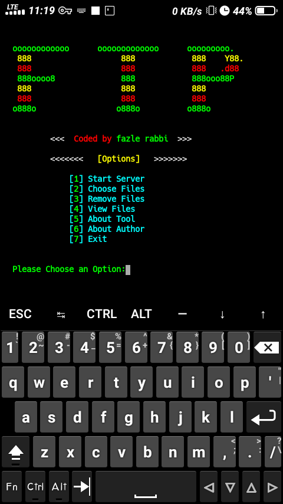

# ftp
Hello there,this is an amazing file sharing tool.You can  share any file from your storage without uploading anywhere.
:point_right: Follow bellow steps for using this tool

 $ pkg install git -y 

 $ git clone https://github.com/fh-rabbi/ftp

 $ cd ftp

 $ bash setup

 $ ftp

  <a style="color:red" href="https://www.facebook.com/fozley.rabbi">Follow me on facebook</a>
# How to use this tool:

``
:point_right: At first choose option 2 and copy your file from your storage to termux.

:point_right: Now turn on your hotspot and choose option 1 ,then you will got a ngrok link ,open it by browser.

:point_right: You can delete ypur copied file by choosing option 3

:point_right: You can see your file which is ready for share by choosing option 4
``
 ## practical video:  
- Tool Screenshot:

jsjs

